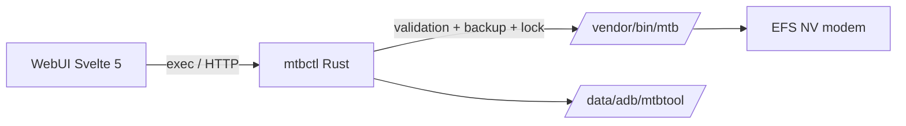

# MTB Tool — Magisk / KernelSU Module

> EFS NV manager for Xiaomi Qualcomm modems as a Magisk/KernelSU module.
> Port of [h3nnes/mtbtool-android-app](https://github.com/h3nnes/mtbtool-android-app) (MIT) —
> the original Android app is preserved in [`app/`](app/) for reference and attribution.

Manage modem EFS NV items directly from a module WebUI: read/write/delete NV
items, bulk import, band lock (LTE / NR NSA / NR SA), disable modem features,
live cell monitor, and one-tap emergency restore. No APK needed — the module
talks to the Qualcomm vendor tool `/vendor/bin/mtb` that already exists on
supported devices.

**The module does NOT bundle or overwrite `/vendor/bin/mtb`.** If your device
does not ship it, the module refuses to install (customize.sh check).

| | |
|---|---|
| **WebUI** | Svelte 5 + TypeScript + Vite, Linear-inspired dark theme (see [frontend/DESIGN.md](frontend/DESIGN.md)) |
| **Backend** | `mtbctl` — single Rust binary (validation, backups, masking, HTTP bridge) |
| **Root** | KernelSU (native WebUI `exec`) · Magisk (WebUI host / localhost HTTP bridge / `action.sh`) |
| **Storage** | `/data/adb/mtbtool` (config + backups) |
| **Target** | POCO F6 (HyperOS, Qualcomm modem), Android 13+, arm64 |

---

## Features

- **Dashboard** — compatibility probe (`/vendor/bin/mtb` presence, model, Android), quick actions, danger notice.
- **Band lock** — detect hardware-supported bands via modem DIAG, or configure
  bands manually; build the LTE / NR NSA / NR SA masks, preview old → new bytes,
  apply with two-step confirmation, restart modem.
- **Modem features** — disable/restore 12 known NR features (UL Tx switching,
  UL MIMO, NR CA, DSS, segmentation, …) with original-value restore, plus the
  5G mode selector (SA/NSA / NSA only / SA only).
- **NV read / import** — read any NV item as a colour-coded hex dump; bulk-import
  the JSON format from the original app (`sim0`/`sim1`/`dualsim`, `op: w/d`)
  with preview before applying.
- **Cells** — live LTE/NR cell monitor (signal metrics + uplink TX power),
  poll interval 1–30 s, stale-value suppression.
- **Backups** — every write/delete is backed up first (`/data/adb/mtbtool/backups`)
  with restore per backup and an emergency restore (module menu / `action.sh`).

## Safety model

1. **Never auto-applies** anything at boot — no band lock, no NV write. Changes
   only happen when you press a button in the WebUI.
2. **Backup before every write/delete.** A failed backup aborts the operation.
3. **Preview + two-step confirmation** for destructive changes.
4. **Backend validation** — `mtbctl` enforces an NV path allowlist, SIM slot
   bounds, hex/size caps, band-number validation and a single-writer lock.
   A tampered WebUI cannot write arbitrary EFS paths.
5. **Emergency restore** — module menu action restores the latest backup.
6. Wrong band masks can cause connectivity loss until restored; the backups tab
   is your undo button.

## Requirements

- Xiaomi device with Qualcomm modem and executable `/vendor/bin/mtb`
  (checked at install time).
- KernelSU / ReSukiSU / APatch / Magisk with module support.
- arm64 (aarch64) only.

## Install

1. Download the release ZIP (`MTB-Tool-vX.Y.Z.zip` + verify `.sha256`).
2. Install via your root manager (KernelSU Manager → modules → install from
   storage, or Magisk → modules → install from storage).
3. Open the module's **WebUI**:
   - KernelSU/ReSukiSU/APatch: native module WebUI button.
   - Magisk: use a WebUI host, or a WebView pointed at
     `http://127.0.0.1:28082` (the module starts a localhost bridge in
     `service.sh`). Terminal users can run the module's action script.
4. Dashboard shows the compatibility probe; if `/vendor/bin/mtb` is missing
   the module refuses to install in the first place.

## Testing

- `cargo test` (backend) + `npm test` (frontend) run in CI (`ci.yml`).
- `tests/smoke.sh` runs `mtbctl` against `tests/fake-mtb.sh` — a
  protocol-faithful simulation of `/vendor/bin/mtb` (one tagged byte per line,
  `ASDIV DATA:`/`TX INFO:` cell lines, `rsp data:` DIAG payloads, absent-item =
  exit 0 + empty, exactly as the original app's parsers expect).
- **Debian ≠ Android.** The harness verifies logic, wire formats and the HTTP
  bridge — not the device. On-phone differences (toybox vs GNU tools, `getprop`,
  real mtb output quirks per ROM) are handled defensively in code: empty/odd
  output → item treated as absent, `getprop` failure → `unknown`, paths and
  slots re-validated at the backend. Always test on your device before trusting
  a release.

## Emergency restore

- **WebUI** — Backups tab → restore latest.
- **Terminal / module menu** — the module's action (action.sh) restores the
  latest backup automatically.

## Uninstall

Removing the module keeps `/data/adb/mtbtool` (backups + config) untouched —
delete that directory manually for a full wipe.

## Build from source

All builds run in GitHub Actions (no local toolchain needed for release):

```bash
# CI checks (cargo test + WebUI build/test)
# auto-release: bump versionCode in module.prop on main → tag + release
```



## Repository layout

```
├── app/            # original Android app (reference, not built)
├── backend/        # mtbctl — Rust CLI + HTTP bridge
├── frontend/       # Svelte 5 WebUI source (built only in GA → webroot/)
│   └── DESIGN.md   # MTB Control design system (Linear-inspired)
├── docs/design-md/ # vendored design references (VoltAgent/awesome-design-md)
├── bin/            # release artifact (gitignored)
├── webroot/        # WebUI build output (gitignored, built by GA)
├── module.prop / customize.sh / service.sh / action.sh / uninstall.sh
├── tools/          # original import tools (nv_import_tool.py, format docs)
└── .github/workflows/  # ci.yml (tests) + release.yml (auto-release)
```

## Roadmap

- [x] v1.0.0 — full feature parity port (band lock, features, NV/import, cells, backups)
- [ ] Playwright E2E for WebUI flows
- [ ] Cell history logging
- [ ] Module settings (port, theme, poll interval)

## Credits & License

- Original app & algorithms: [h3nnes/mtbtool-android-app](https://github.com/h3nnes/mtbtool-android-app)
  — MIT License (see [LICENSE](LICENSE)).
- This module: MIT License, © Alfnnnnyy.
- Design language inspired by [Linear](https://linear.app) via
  [VoltAgent/awesome-design-md](https://github.com/VoltAgent/awesome-design-md).
